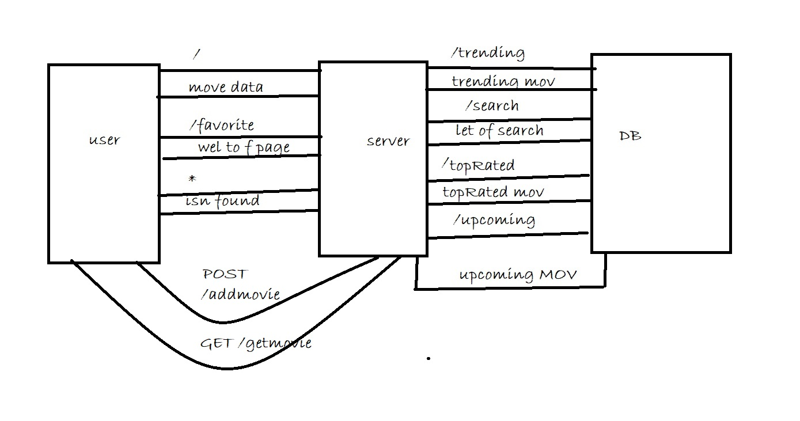

# The Movie  - V1.0

**Author Name**: Waseem Abuameer

## WRRC

## Getting Started
<!-- What are the steps that a user must take in order to build this app on their own machine and get it running? -->
1.npm init -y
2.npm install express cores 
3.call express
**make listen to port
4.initialize app (app=express())
7.make init point "/"=>datamoves
8.make function that end point
9.cathe error

## Project Features
<!-- What are the features included in you app -->
when make http://localhost:3003/ give data moves
and http://localhost:3003/favorite give favorite moves from data
# The Movie  - V2.0

**Author Name**: Waseem Abuameer

## WRRC

## Getting Started
<!-- What are the steps that a user must take in order to build this app on their own machine and get it running? -->
1-call Axios call by install
2-call dotenv to more security

## Project Features
<!-- What are the features included in you app -->
when make http://localhost:3003/ give data moves
, http://localhost:3003/favorite give favorite moves from data
3-make pint init (toprated==upcoming==search==trending)
# The Movie  - V3.0

**Author Name**: Waseem Abuameer

## WRRC

## Getting Started
<!-- What are the steps that a user must take in order to build this app on their own machine and get it running? -->
1-call Axios call by psql and pg 
** call sqlstart
2-call pg to connect the database (create database)
3-intialize the conction  (client by pg.constrictoer)
4-conecte to database then call or start server
5-

## Project Features
<!-- What are the features included in you app -->
when make http://localhost:3003/ give data moves
, http://localhost:3003/favorite give favorite moves from data
3-make pint init (getmovies======addmovies);
